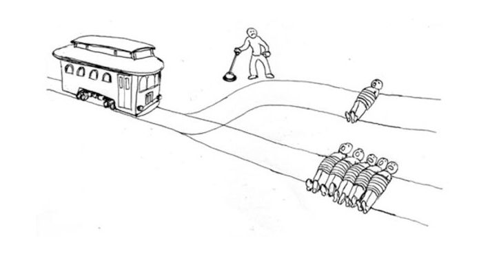
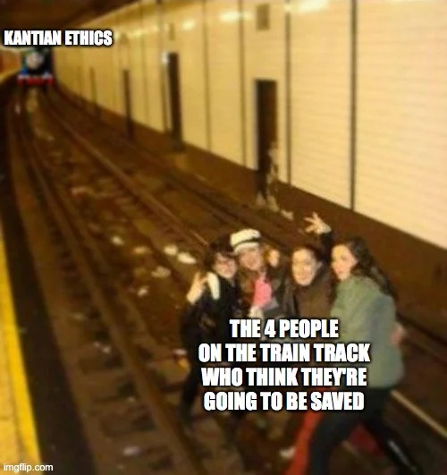
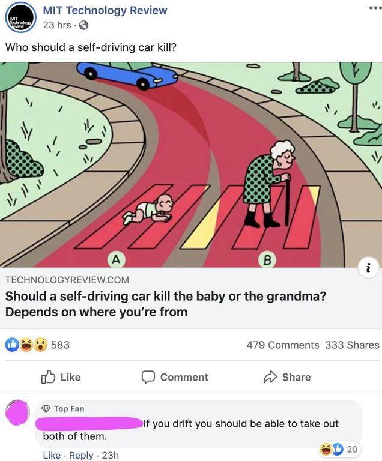

+++
date = 2020-07-08T15:57:43-04:00
title = "Trolley Problem Memes, Explained"
description = "Trolley Problems, what good are they anyway? One thing I've come to learn is that you can learn a lot through memes. Here, I am going to attempt to briefly explain a few simple philosophy concepts using memes."
slug = "20_07_08_trolley_problem_memes"
tags = ["trolley problem", "memes"]
categories = ["philosophy"]
+++

# Several Trolley Problem Memes, Explained

You've probably heard of the Trolley Problem, if not let me explain.

## The Trolley Problem, Explained

There's a trolley charging down the tracks. It's heading towards a path with five people on it. If nothing is done, these people will surely be doomed.

**GOOD NEWS!** There just happens to be a lever which switch the tracks to a different path, thus causing the train to miss five people.

**bad news** Pulling the lever will cause one person, who was previously safe, to die.

What do you do? Most people say they would pull the lever. Some argue that doing this would make you a murderer, so you still shouldn't do it. But you are also saving five others, which seems like a pretty good outcome.

In the end, even though people *say* they would pull the lever, you might just end up emotionally frozen and do nothing at all. Michael Stevens from *VSause* conducted [a study to prove this](https://www.youtube.com/watch?v=1sl5KJ69qiA) on his show, *Mind Field*[^4].

I thought it would be fun to look at trolley problem memes and try to explain them. So here we go!

### Kantian Ethics

Kantian ethics says that no person should ever be used as a means to an end. Immanuel Kant wouldn't kill the one person to save four, because that would be taking their life, even if it saves four other lives.

Another example of Kantian ethics is the following scenario:

> There's been a series of robberies going around. If the case isn't solved soon, there will be riots in the streets. There is a witness, who the police know to be innocent. However, if the witness is arrested and jailed for the crime, people will think that the crime has been solved, and no rioting will occur.
>
> Do you jail the man in witness to stop the riots?

Kant would say, no. Jailing the witness would be using the person as a means to an end, which is not allowed. There may be riots, but at least you didn't actively do a bad deed.

### Self-Driving Car

This is commonly presented when we talk about self-driving cars. There will probably eventually come a time when a computer has no choice but to kill someone, so who does it kill. There's a [quiz](https://www.moralmachine.net/), where you can decide who to kill. Here are some examples:

> Do you kill the billionaire, or the homeless guy?

> Do you kill the doctor, or the CEO?

> Do you kill five children, or two adults?

Of course, these scenarios are very rare, so companies haven't put much thought into them yet.[^1] They'd rather focus on the technology for now, and not have to do with the PR nightmare that would result from announcing their decision that lawyers probably deserve to die anyway, who doesn't want to kill their grandma?, and let's be honest, how much do insurance agents really contribute to society?[^2]

### Ship of Theseus

The Ship of Theseus paradox questions, whether, in this instance, it's really the same train, since every part is replaced. If not, when did it become a new train? Was it when a third of the components were replaced? Half? All of it?

I don't think whether or not it's the same train is the real issue here though. From a consequentialist view, what really matters is one person is still going to die. The best solution here is probably to divert the train, but hope that the person is able to free themselves within the next 20 hours[^3].

## More Problems

That's all I can be bothered to explain at the moment. If you want more trolley problem memes, [here](https://www.reddit.com/r/PhilosophyMemes/search?q=trolley&restrict_sr=on&include_over_18=on). I'll also offer this [bonus list of trolley problems](https://www.newyorker.com/magazine/2020/06/22/presidential-trolley-problems).

[^1]: How often have you been in that kind of situation? A computer is going to think fourteen steps ahead of you, so it will be even rarer for an AI to be in this situation.
[^2]: In case it wasn't obvious, this was a joke. If it makes you feel better, my mom is an insurance agent, and I know several grandmothers. Uhhh, my best friend's dad used to be a lawyer if that counts for anything.
[^3]: The top speed of the San Diego Trolley is [55 miles per hour](https://en.wikipedia.org/wiki/San_Diego_Trolley), so I used 50 for easy math. 1000 miles / 50 miles per hour = 20 hours
[^4]: I'm aware it was a very small sample size, but it still shows that some people will freeze up